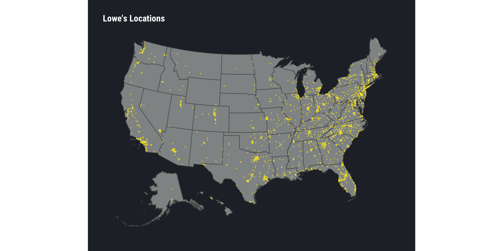

# loweslocations

This past week [Lowe’s told their assemblers they were all out of a
job](https://www.wsj.com/articles/lowes-lays-off-thousands-of-store-workers-11564680676).
This decision impacts \~1-3 (sometimes more depending on the store)
workers per [Lowe’s store](https://www.lowes.com/Lowes-Stores) and
Lowe’s assemblers used to make between \~$13.00 & $18.00 USD/hour.

The `data` directory contains
[`lowes-stores-geo.csv.gz`](data/lowes-stores-geo.csv.gz) which is
lovingly hand-crafted transcription of all the locations listed at
<https://www.lowes.com/Lowes-Stores>. The addresses have been geolocated
(using [{rgeocodio}](https://git.rud.is/hrbrmstr/rgeocodio)) and
contain:

  - store name
  - store published address
  - store geocoded legit address
  - store phone \#
  - county
  - city
  - state
  - longitude
  - latitude

which should be sufficient to enable data journalists to cross reference
with census/economic data to facilitate potential regional impact
reporting.

## Some Summary Info

``` r
library(sf)
library(albersusa)
library(hrbrthemes)
library(tidyverse)
```

``` r
cols(
  o_addr = col_character(),
  fmt_addr = col_character(),
  phone = col_character(),
  city = col_character(),
  county = col_character(),
  state = col_character(),
  lat = col_double(),
  lng = col_double()
) -> lowes_cols

lowes <- read_csv(here::here("data/lowes-stores-geo.csv.gz"), col_types = lowes_cols)
```

``` r
head(lowes) %>% 
  knitr::kable("markdown")
```

| o\_addr                                | fmt\_addr                                        | phone          | city      | county                       | state |      lat |         lng |
| :------------------------------------- | :----------------------------------------------- | :------------- | :-------- | :--------------------------- | :---- | -------: | ----------: |
| 333 East Tudor Rd , AK 99503           | 333 E Tudor Rd, Anchorage, AK 99503              | (907) 563-0391 | Anchorage | Anchorage Municipality       | AK    | 61.18100 | \-149.87856 |
| 1200 North Muldoon , AK 99504          | 1200 N Muldoon Rd, Anchorage, AK 99504           | (907) 269-2400 | Anchorage | Anchorage Municipality       | AK    | 61.22563 | \-149.74607 |
| 10900 Old Seward Highway , AK 99515    | 10900 Old Seward Hwy, Anchorage, AK 99515        | (907) 349-8889 | Anchorage | Anchorage Municipality       | AK    | 61.12179 | \-149.86645 |
| 425 Merhar Ave , AK 99701              | 425 Merhar Ave, Fairbanks, AK 99701              | (907) 451-4700 | Fairbanks | Fairbanks North Star Borough | AK    | 64.85682 | \-147.69653 |
| 2561 East Sun Mountain Ave , AK 99654  | 2561 E Sun Mountain Ave, Wasilla, AK 99654       | (907) 352-3100 | Wasilla   | Matanuska-Susitna Borough    | AK    | 61.57333 | \-149.38457 |
| 235 Colonial Promenade Pkwy , AL 35007 | 235 Colonial Promenade Pkwy, Alabaster, AL 35007 | (205) 685-4060 | Alabaster | Shelby County                | AL    | 33.23110 |  \-86.80503 |

``` r
filter(lowes, !(state %in% c("HI", "AK"))) %>% 
  select(lon=lng, lat) %>% 
  bind_rows(
    filter(lowes, (state %in% c("HI", "AK"))) %>% 
      select(lng, lat) %>% 
      points_elided(.) %>% 
      select(lon=1, lat=2)
  ) %>% 
  st_as_sf(
    coords = c("lon", "lat"),
    crs = us_longlat_proj, 
    agr = "constant"
  ) -> pts
```

``` r
ggplot() +
  geom_sf(data = usa_sf("longlat"), fill = ft_cols$gray) +
  geom_sf(data = pts, size = 0.5, alpha = 1/2, color = ft_cols$yellow) +
  coord_sf(crs = us_laea_proj, datum = NA) + 
  labs(
    x = NULL, y = NULL,
    title = "Lowe's Locations"
  ) +
  theme_ft_rc(grid="") +
  theme(axis.text = element_blank())
```



``` r
count(lowes, state, sort=TRUE) %>% 
  top_n(10) %>% 
    knitr::kable()
```

| state |   n |
| :---- | --: |
| TX    | 142 |
| FL    | 126 |
| NC    | 114 |
| CA    | 110 |
| OH    |  83 |
| PA    |  83 |
| NY    |  70 |
| VA    |  69 |
| GA    |  63 |
| TN    |  60 |

``` r
count(lowes, county, state, sort=TRUE) %>% 
  top_n(10) %>% 
  knitr::kable()
```

| county                | state |  n |
| :-------------------- | :---- | -: |
| Maricopa County       | AZ    | 21 |
| Los Angeles County    | CA    | 20 |
| Harris County         | TX    | 18 |
| Clark County          | NV    | 13 |
| Riverside County      | CA    | 12 |
| Tarrant County        | TX    | 11 |
| Bexar County          | TX    | 10 |
| San Bernardino County | CA    | 10 |
| Allegheny County      | PA    |  9 |
| Dallas County         | TX    |  9 |
| Franklin County       | OH    |  9 |
| Hillsborough County   | FL    |  9 |
| Mecklenburg County    | NC    |  9 |

Assuming $17/hr (\~35K/yr) and no same-store re-hiring,
\~**$61,030,500** annual wages decrease across the whole list and for
the top 10 counties:

``` r
count(lowes, county, state, sort=TRUE) %>% 
  mutate(wages_lost = scales::dollar(n * 35380)) %>% 
  top_n(10, wt = n) %>% 
  knitr::kable(align = "llrr")
```

| county                | state |  n | wages\_lost |
| :-------------------- | :---- | -: | ----------: |
| Maricopa County       | AZ    | 21 |    $742,980 |
| Los Angeles County    | CA    | 20 |    $707,600 |
| Harris County         | TX    | 18 |    $636,840 |
| Clark County          | NV    | 13 |    $459,940 |
| Riverside County      | CA    | 12 |    $424,560 |
| Tarrant County        | TX    | 11 |    $389,180 |
| Bexar County          | TX    | 10 |    $353,800 |
| San Bernardino County | CA    | 10 |    $353,800 |
| Allegheny County      | PA    |  9 |    $318,420 |
| Dallas County         | TX    |  9 |    $318,420 |
| Franklin County       | OH    |  9 |    $318,420 |
| Hillsborough County   | FL    |  9 |    $318,420 |
| Mecklenburg County    | NC    |  9 |    $318,420 |
